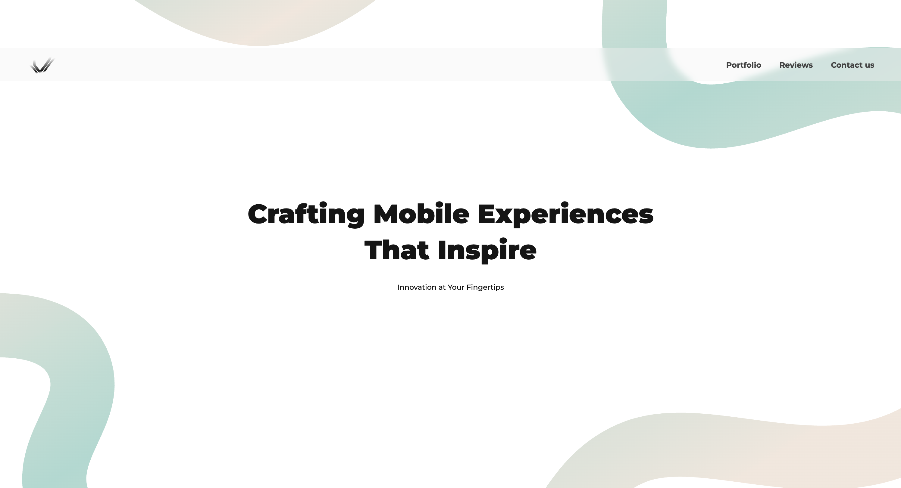

# Anyalen
###### Commercial Project | Full-cycle Development

**Project Overview:** A landing page for a mobile development agency (iOS & Android) showcasing service portfolios, client testimonials, and business contact points.

**Visual Motion:** Leverages GSAP and Lenis to provide inertial scrolling and interface animations.

**Core Architecture:** Built with JavaScript and Vite, utilizing EmblaCarousel for interactive content delivery.

**CI/CD Pipeline:** Automated deployment via GitHub and Netlify for instant production updates and hosting.

**Tech Stack**  
JavaScript, HTML, CSS, GSAP, EmblaCarousel, Lenis, Vite, Netlify.

 

<h1>
  <a href="https://anyalen.com/">
    Visit
  </a>
</h1>

 

